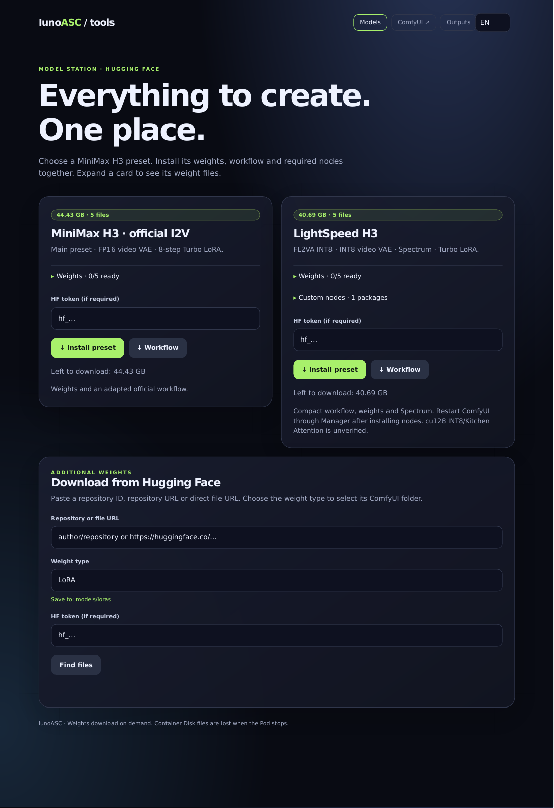
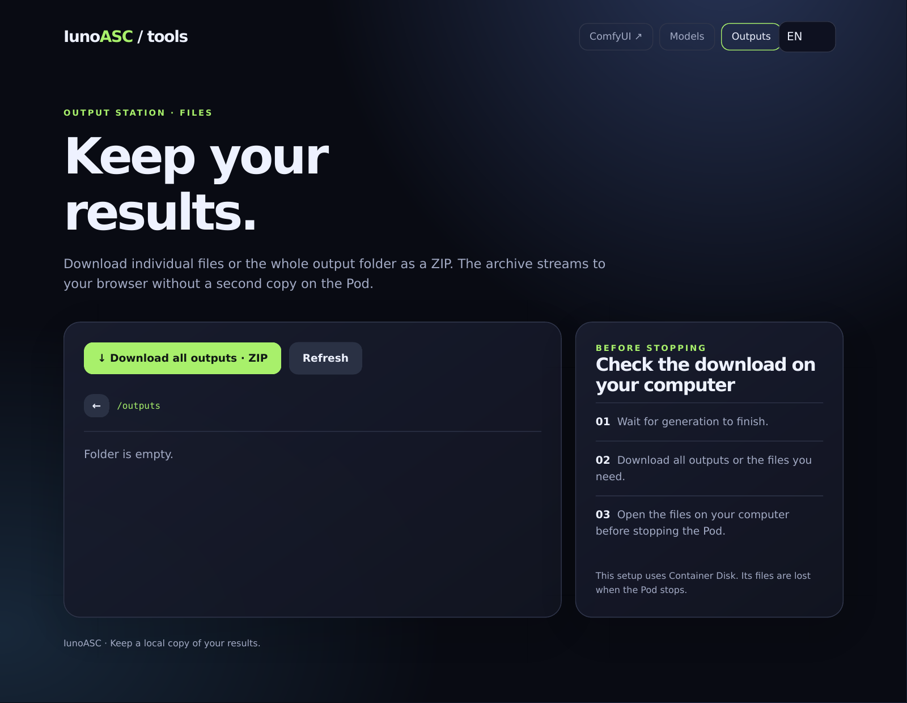

# IunoASC ComfyUI

ComfyUI for RunPod with MiniMax H3 presets, classic Manager, one-click model installation and an output browser. Weights are downloaded on demand; they are not bundled in the image.

[Docker Hub](https://hub.docker.com/r/solozeet/comfyui/tags) · [Build status](https://github.com/solozet/IunoASC-ComfyUI/actions/workflows/build.yml) · [ComfyUI v0.38.0](https://github.com/Comfy-Org/ComfyUI/releases/tag/v0.38.0)

## Quick start

| RunPod template field | Value |
| --- | --- |
| Container image | `solozeet/comfyui:cu130` |
| Start Command | **Empty** — the image starts its own services |
| HTTP ports | `3000,8081,8083` |
| Container Disk | **150 GB** for the image, presets and working output space |
| Volume Disk / network volume | Not required by this setup |
| Required environment variables | **None** |
| Login / password | None |

1. Launch the Pod and check its logs for `[IunoASC] GPU preflight passed` and the ComfyUI ready message.
2. Open the models panel on port **8081** and choose a preset. **Install preset** downloads missing weights, saves the workflow on the Pod and downloads a JSON copy in your browser.
3. For **LightSpeed H3**, restart **ComfyUI through Manager** after installing Spectrum. Import the downloaded JSON or open the saved workflow in ComfyUI.
4. Download finished outputs from port **8083** before stopping or deleting the Pod.

If the direct ComfyUI link from RunPod returns HTTP 403, try **ComfyUI ↗** in the models panel. ComfyUI's cross-site origin check can reject a navigation from another site. This check is not authentication.

## Interfaces

| HTTP port | Interface | Features |
| --- | --- | --- |
| **3000** | ComfyUI | Native H3 nodes, classic Manager interface |
| **8081** | Models & presets | Two compact preset cards, collapsible weight lists, HF weight downloads with explicit destination folders |
| **8083** | Outputs | Folder browsing, individual downloads, streaming ZIP |

Both panels support **English, Russian, German, French, Simplified Chinese and Japanese**. Use the language selector in the header. The choice is stored in the browser and carried in links between ports. Browser language is used for the initial selection, with English as the fallback.

Models and presets panel

Outputs panel

These are HTML-rendered previews of the actual panel source and API data, converted through PDF to PNG. They show a fresh setup with no downloaded weights or outputs; PDF form rendering can differ slightly from a browser.

RunPod provides a separate HTTPS address for each port: `https://POD_ID-PORT.proxy.runpod.net/`. Links between the panels select the correct port automatically. These endpoints have no password; anyone with access to their URLs can use them.

## Presets

| | Official MiniMax H3 I2V | **LightSpeed H3** |
| --- | --- | --- |
| Workflow | Adapted Comfy Org native I2V example | Compact subgraph based on the user-edited workflow |
| Diffusion model | FL2VA pruned INT8 ConvRot; FP8 scaled in cu128 | FL2VA pruned INT8 ConvRot |
| Text encoder | Qwen3-VL 32B NVFP4 AWQ | Same encoder |
| Video VAE | FP16 | **INT8 ConvRot** |
| Audio VAE | FP32 | Same audio VAE |
| LoRA | Official 8-step Turbo | Turbo v4 + optional user LoRA |
| Custom nodes | None required by the example | **Spectrum MiniMax H3** |
| Selected sampling steps | 8 | 5 in the supplied JSON |
| Weight files | 5 | 5 |
| Total weights, decimal GB | **44.43 GB** with INT8; **44.41 GB** with FP8 | **40.69 GB** |
| Install button | Weights + workflow | Weights + workflow + Spectrum |

With the default **cu130 official preset** already installed, LightSpeed adds the **2.81 GB INT8 video VAE** and **0.62 GB Turbo v4 LoRA**. Both presets together use **47.86 GB** in weights. These totals exclude the image, input media, outputs and caches. cu128 uses a different diffusion file, so that file is not shared with LightSpeed.

### LightSpeed H3 — source and credit

LightSpeed H3 is based on **[MiniMax H3 Ultra Fastest True 4 Steps + HD Sound | 6GB VRAM 16GB RAM [V8 Update] Lightning Speed](https://civitai.com/models/2835250?modelVersionId=3305336)** by **[RedditUser9811](https://civitai.com/user/RedditUser9811)**.

The original workflow was simplified by the user to the branches and weights they actually use, then supplied as `MY.json`. This preset packages it as a compact native subgraph with editable video settings and separate Turbo/user LoRA controls. The source title's “4 Steps” and memory figures describe the upstream resource; the supplied JSON selects **5 steps** and is not a verified hardware minimum for this container.

| LightSpeed weight | ComfyUI directory | Size |
| --- | --- | ---: |
| `minimax_h3_fl2va_pruned_int8_convrot.safetensors` | `diffusion_models` | 20.97 GB |
| `qwen3vl_32b_minimax_h3_nvfp4_awq.safetensors` | `text_encoders` | 15.69 GB |
| `minimax_h3_video_vae_int8_convrot.safetensors` | `vae` | 2.81 GB |
| `minimax_h3_audio_vae_fp32.safetensors` | `vae` | 0.61 GB |
| `minimax_h3_turbo_v4_step600_ema_pruned_comfyui.safetensors` | `loras` | 0.62 GB |

The first four weights come from [Comfy-Org/MiniMax-H3](https://huggingface.co/Comfy-Org/MiniMax-H3); Turbo v4 comes from [drbaph/MiniMax-H3-Turbo-Lora-ComfyUI](https://huggingface.co/drbaph/MiniMax-H3-Turbo-Lora-ComfyUI). The selected loader filenames determine the downloads; old REF2VA and FP16 VAE metadata inside the JSON is not used to select weights.

### What installation does

| Component | Behavior |
| --- | --- |
| Weights | Downloads missing files; checks expected byte sizes; reuses matching files |
| Workflow | Saves to `/opt/ComfyUI/user/default/workflows` and offers a browser download |
| LightSpeed workflow filename on Pod | `lightspeed-h3.json` |
| Spectrum | Installs [ComfyUI-Spectrum-MiniMax-H3](https://github.com/xmarre/ComfyUI-Spectrum-MiniMax-H3) at `dc6e1b335e1cdcd078a649add6464dab9469a587` |
| Existing Spectrum installation | Preserved; not overwritten or upgraded |
| ComfyUI restart | Manual through Manager to load newly installed nodes |
| Status after page reload | Rechecks weight files on disk; matching sizes show as ready |

LightSpeed has Turbo v4 enabled at strength 1.0. Its additional LoRA is disabled by default and reuses the Turbo filename as a valid placeholder until you select your own file. There is no TAE preview or RTX upscale. Its six image inputs are bypassed. Enable and supply your own reference images when needed. Spectrum is its only custom-node package; the pinned snapshot has no additional pip dependencies.

The official I2V example is adapted from Comfy Org's workflow; its MIT license is included in [`workflows/LICENSE`](workflows/LICENSE).

### LightSpeed controls

| Control | Default / behavior |
| --- | --- |
| Prompt | Editable inside the compact node; empty by default |
| Resolution | Main-canvas selector with aspect ratio, megapixels and live dimensions; 9:16, 2 MP, multiple 32 |
| Duration / steps | 5 seconds / 5 steps |
| FPS | 24; also drives frame count, rounded to H3's supported frame lengths |
| Color / depth | HDR / 10-bit; SDR and other supported bit depths selectable |
| Turbo v4 LoRA | Enabled / strength 1.0 |
| Additional LoRA | File selector, enable switch and strength; disabled by default |
| Spectrum | Enabled; detailed settings inside the subgraph |
| Noise | Inside the subgraph; randomize by default |
| Resolution reference table | On the main canvas |

### Download your own weights

Paste `author/repository`, a Hugging Face repository URL, or a `blob`/`resolve` file URL. Click **Find files**, choose a file and its type, then **Download weight**. A direct file URL preselects that file. The selected type determines the destination; the downloader does not infer model architecture or compatibility.

| Selected type | ComfyUI destination |
| --- | --- |
| LoRA (default) | `models/loras` |
| Diffusion model | `models/diffusion_models` |
| Text encoder | `models/text_encoders` |
| VAE | `models/vae` |

Supported file extensions: `.safetensors`, `.gguf`, `.ckpt`, `.bin`, `.pt`, `.pth`. Listing a file does not guarantee that ComfyUI has the loader needed for that format. Files are saved under their basename; an existing non-empty file of that name is reused. Preset weights additionally check exact byte sizes. Refresh ComfyUI's model lists after downloading and choose the file in its loader.

## Image variants

| Image suffix | NVIDIA base CUDA | PyTorch | Default attention / diffusion | Host driver policy |
| --- | --- | --- | --- | --- |
| **`cu130`** | 13.0.2 | 2.9.1+cu130 | Comfy Kitchen / INT8 ConvRot | ≥ 580.95.05 |
| `cu128` | 12.8.1 | 2.9.1+cu128 | Standard attention / FP8 scaled | ≥ 570.124.06 |
| `cu131` | 13.1.1 | 2.9.1+cu130 | Comfy Kitchen / INT8 ConvRot | ≥ 590.48.01 |
| `cu132` | 13.2.0 | 2.9.1+cu130 | Comfy Kitchen / INT8 ConvRot | ≥ 595.45.04 |

Use `solozeet/comfyui:<suffix>` to switch variants. Each also has a ComfyUI-release tag such as `solozeet/comfyui:comfy0.38.0-cu130`. Both tag forms are updated by rebuilds; use an image digest if you need an immutable build.

**cu131 and cu132 are experimental NVIDIA-base variants. They still use the PyTorch CUDA 13.0 wheel.** A newer base does not upgrade the wheel's CUDA dependencies or repair a host driver. See [PyTorch 2.9.1 packages](https://pytorch.org/get-started/previous-versions/#v291).

The driver thresholds are this project's conservative policy, not universal NVIDIA minimums. They use the paired drivers from NVIDIA's release notes: [12.8.1](https://docs.nvidia.com/cuda/archive/12.8.1/cuda-toolkit-release-notes/index.html), [13.0.2](https://docs.nvidia.com/cuda/archive/13.0.2/cuda-toolkit-release-notes/index.html), [13.1.1](https://docs.nvidia.com/cuda/archive/13.1.1/cuda-toolkit-release-notes/index.html), [13.2.0](https://docs.nvidia.com/cuda/archive/13.2.0/cuda-toolkit-release-notes/index.html). RunPod's CUDA filter helps select hosts; the exact driver and GPU checks still come from startup logs.

LightSpeed keeps the supplied INT8/Kitchen Attention settings in every image. Its compatibility with **cu128 is unverified**; the cu128 default applies to the official preset.

## Included stack

| Component | Version / mode |
| --- | --- |
| ComfyUI | **v0.38.0** |
| ComfyUI Manager | **4.2.2**, enabled with classic UI |
| Comfy Kitchen | **0.2.36** |
| PyTorch / torchvision / torchaudio | **2.9.1 / 0.24.1 / 2.9.1** |
| Model downloads | Hugging Face Hub |
| Web panels | FastAPI / Uvicorn |
| ComfyUI gateway | nginx |

Classic Manager uses `--enable-manager --enable-manager-legacy-ui`; no separate Manager port or installation is needed. ComfyUI 0.38.0 includes H3 VAE seam and offloaded `rms_rope` fixes; see its [release notes](https://github.com/Comfy-Org/ComfyUI/releases/tag/v0.38.0).

## Storage and configuration

| Item | Location / behavior |
| --- | --- |
| Models | `/data/models`, linked to ComfyUI's `models` directory |
| Input media | `/data/inputs` |
| Generated outputs | `/data/outputs` |
| HF tokens | Optional fields in the downloader; not saved in image or configuration |

This setup uses Container Disk rather than persistent storage. Save outputs and any custom changes before stopping or deleting the Pod. Job progress lives in memory: restarting the models panel loses the progress record, but repeating installation reuses completed weights of the expected size.

## Validation and troubleshooting

| Check | Status / scope |
| --- | --- |
| CI tests | Preset manifests, subgraph links/defaults, HF URL/folder routing, installer retries and preflight error handling |
| Panel checks | All six dictionaries, language switching/persistence, cross-port links, direct file selection and destination folder |
| Image build checks | CPU imports; public services on all three ports; both preset/workflow APIs; output file and ZIP downloads |
| Spectrum installation | Pinned Git snapshot and repeat installation verified in a temporary directory |
| Prior GPU startup | CUDA/Kitchen smoke tests and ComfyUI startup passed on an RTX 4090 with cu130 |
| Full generation in this updated image | **Not yet validated on GPU** |
| LightSpeed local use | User reports 16 GB RAM, 12 GB VRAM and a 90 GB pagefile; not a container benchmark |

Startup preflight reports the base CUDA, PyTorch CUDA, GPU, driver and VRAM. It tests CUDA initialization, FP16 matrix multiplication, standard attention and, for Kitchen images, CUDA quantization. It has a 90-second timeout; it does not validate full H3 generation or peak memory use.

**A failed preflight exits the container but does not stop the paid RunPod allocation.** Save the logs and stop a failing Pod yourself. The image cannot install a host driver or fix a broken GPU host. A successful build is not a GPU generation test.

## Building

| Step | Action |
| --- | --- |
| Docker Hub | Create the `comfyui` repository |
| GitHub secrets | Set `DOCKERHUB_USERNAME` and `DOCKERHUB_TOKEN` |
| Publish | A push to `main` builds and publishes all four variants |
| Manual build | Run **Build IunoASC ComfyUI** in GitHub Actions |
| Documentation-only changes | Use `[skip ci]` to avoid an unnecessary image rebuild |

Workflow: [`.github/workflows/build.yml`](.github/workflows/build.yml).
